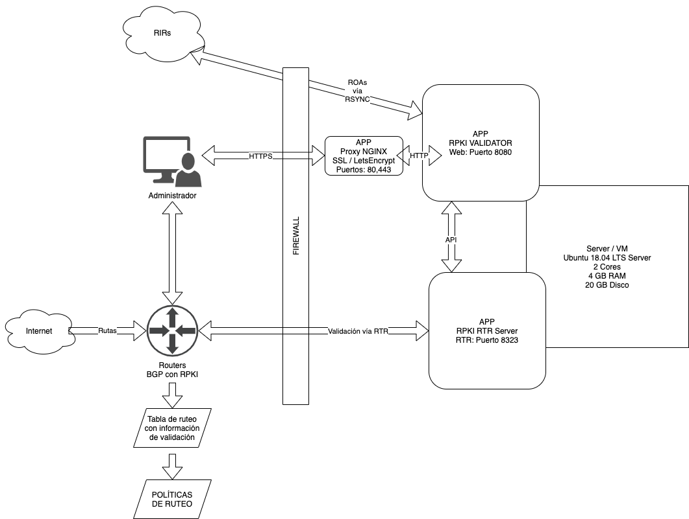

# RIPE Validator 3
El proyecto RIPE RPKI Validator v3 consiste de dos componentes

* RPKI Validator (descarga ROAs desde los RIR)
* RPKI RTR Server (habla con los routers que soportan RPKI)

## Instalación manual

Todo esto fue probado en Ubuntu 18.04 LTS Server recién instalado (solo agregamos el paquete de _SSH_ durante la instalación) y los comandos se ejecutan como el usuario _root_ (en caso contrario usar `sudo` donde corresponda).

Se optó por este método de instalación debido a que se tiene control de cada aspecto del sistema, en vez de depender de paquetes adaptados para cada tipo de sistema operativo.

A futuro vamos a cubrir instalaciones más automatizadas mediante el uso de paquetes y playbooks.

## Diagrama de la solución



## Requisitos previos

El desarrollador recomienda una máquina virtual o servidor físico con al menos 2 gigabytes de RAM disponibles. El autor recomienda disponer de 4 gigabytes de memoria RAM.

```bash
# Instalamos el software base
apt update && apt install -y default-jre-headless rsync wget curl ntp nginx ufw apache2-utils

# Activamos NTP
systemctl enable ntp
systemctl start ntp

# Creamos el usuario que va a ejecutar todo
useradd --system rpki --shell /sbin/nologin
```

## Instalar RPKI Validator

```bash
# Instalar RIPE VALIDATOR 3
cd /tmp
mkdir -p /usr/local/rpki-validator-3
wget https://ftp.ripe.net/tools/rpki/validator3/prod/generic/rpki-validator-3-latest-dist.tar.gz
tar xf rpki-validator-3-latest-dist.tar.gz -C /usr/local/rpki-validator-3 --strip-components 1

# Antes de usar esto tienes que leer y aceptar el Relying Party Agreement de ARIN
# Ejecutar el siguiente comando implica que usted entiende y acepta todos los
# terminos de ese documento.
cd /usr/local/rpki-validator-3/preconfigured-tals/
wget https://www.arin.net/resources/manage/rpki/arin-ripevalidator.tal
cd /usr/local/rpki-validator-3/

# Establecemos permisos
chown -R rpki:rpki /usr/local/rpki-validator-3/

# Agregamos servicio a systemd
curl -L https://raw.githubusercontent.com/LACNOG/rpki-validator-install-tour/master/ripe_validator/ripeval.service > /etc/systemd/system/ripeval.service
systemctl daemon-reload
systemctl enable ripeval
systemctl start ripeval

# Chequear estado de RIPE Validator (salir con la letra Q)
systemctl status ripeval

# Luego de unos minutos, verificar ROAs recibidos
curl -H "Accept: text/csv" localhost:8080/api/export.csv
```

## Instalar RPKI RTR Server

Este es el componente que va a dialogar el protocolo RTR contra nuestros routers BGP que tengan habilitada la validación RPKI.

Esta instalación contempla que tanto el RPKI Validator como el RTR Server se encuentran instalados en el mismo equipo. Si bien su instalación en equipos diferentes es posible, está fuera del alcance de este documento.

```bash
# Instalar RTR Server
cd /tmp
mkdir -p /usr/local/rpki-rtr-server
wget https://ftp.ripe.net/tools/rpki/validator3/prod/generic/rpki-rtr-server-latest-dist.tar.gz
tar xf rpki-rtr-server-latest-dist.tar.gz -C /usr/local/rpki-rtr-server --strip-components 1
cd /usr/local/rpki-rtr-server

# Establecemos permisos
chown -R rpki:rpki /usr/local/rpki-validator-3/

# ¡¡¡CUIDADO!!!
# El siguiente comando indica que el servidor RTR escuche
# en todas las interfaces de red en el puerto 8323
# Antes de ejecutarlo asegurar el puerto 8323 con un firewall de manera que
# solo los routers habilitados puedan accederlo
sed -e '/server.address=localhost/ s/localhost/::/' -i conf/application.properties

# Agregamos servicio a systemd
curl -L https://raw.githubusercontent.com/LACNOG/rpki-validator-install-tour/master/ripe_validator/ripertr.service > /etc/systemd/system/ripertr.service
systemctl daemon-reload
systemctl enable ripertr
systemctl start ripertr

# Chequear estado de RPKI RTR Server (salir con la letra Q)
systemctl status ripertr

# Chequear si el puerto está abierto
# Debería devolver una linea que contenga las palabras "LISTEN" ":::8323" y "java"
netstat -tnple | grep 8323
```

## Seguridad del servicio RTR

:warning::warning::warning::warning::warning::warning::warning::warning::warning::warning:
ADVERTENCIA IMPORTANTE
:warning::warning::warning::warning::warning::warning::warning::warning::warning::warning:

> En este punto del tutorial vamos a aplicar firewall al equipo. Si no estamos seguros de lo que estamos haciendo, podríamos provocar una pérdida total o parcial de conectividad hacia el equipo.
El autor no recomienda dejar los servicios expuestos en un servidor con dirección IP pública sin garantizar la adecuada seguridad de los servicios.
En caso de que no se desee filtrar puertos y direcciones IP mediante la configuración de firewall es preferible colocar el servidor en una [dirección IP privada](https://es.wikipedia.org/wiki/Red_privada) que solo sea alcanzable por los routers de ISP que desea validar RPKI.

El aplicar firewall consiste en aplicar seguridad de manera tal que solamente los equipos permitidos puedan hablar con el servidor que estamos configurando.

En este **ejemplo** vamos a suponer que las direcciones IP de nuestros routers BGP que hablarán contra el servidor RTR son:

* 198.51.100.1
* 198.51.100.2
* 198.51.100.3
* 2001:db8:cafe::1
* 2001:db8:cafe::2
* 2001:db8:cafe::3

Entonces vamos a configurar al proceso RTR para que solamente acepte conexiones originadas en esas direcciones IP.

Además vamos a permitir acceso HTTP/HTTPS desde todo el mundo para acceder al portal web del RPKI Validator. Esto se utiliza principalmente para poder generar certificados SSL gratuitos con [LetsEncrypt](https://letsencrypt.org/).

También permitimos conexiones a cualquier puerto desde nuestras redes de gestión, que en este ejemplo son:

* 192.168.21.0/24
* 2001:db8:beba:cafe::/64

```bash
# Agrego el servicio RTR a la base de datos local
echo -e "rpki-rtr\t8323/tcp\t\t #RIPE NCC RPKI RTR Server" >> /etc/services

# Configuro UFW
## Letsencrypt / Portal Web RPKI Validator
ufw allow 80
ufw allow 443

## Redes de gestion
ufw allow from 192.168.21.0/24
ufw allow from 2001:db8:beba:cafe::/64

## Routers BGP que validan RPKI
ufw allow proto tcp from 198.51.100.1 to any port 8323
ufw allow proto tcp from 198.51.100.2 to any port 8323
ufw allow proto tcp from 198.51.100.3 to any port 8323
ufw allow proto tcp from 2001:db8:cafe::1 to any port 8323
ufw allow proto tcp from 2001:db8:cafe::2 to any port 8323
ufw allow proto tcp from 2001:db8:cafe::3 to any port 8323

# Activar Ubuntu Firewall (tipear Y cuando lo pregunte)
ufw enable

# Chequear estado del firewall (todo lo que no está permitido: "ALLOW", se deniega)
ufw status
```

#### Proxy reverso NGINX

El RPKI Validator expone una página web en el puerto 8080 que por defecto no tiene ningún tipo de autenticación. En esta parte del documento vamos a instalar un servidor web que escuche en los puertos estándares (80, 443) y que además nos pida un usuario y contraseña para poder acceder a la gestión del Validador RPKI.

```bash
curl -L https://raw.githubusercontent.com/LACNOG/rpki-validator-install-tour/master/ripe_validator/nginx-nossl.conf > /etc/nginx/sites-available/default

# Creo el archivo donde guardar los usuarios
touch /etc/nginx/.htpasswd

# Creo los usuarios
htpasswd /etc/nginx/.htpasswd admin
htpasswd /etc/nginx/.htpasswd admin2
htpasswd /etc/nginx/.htpasswd otroadmin

# Reinicio el servicio
systemctl restart nginx
```

Ahora se debe poder visitar el sitio accediendo a: http://ip.del.rpki.validator

Por ejemplo: http://172.30.0.130

#### Agregar Certificado SSL válido con LetsEncrypt

Lo que vamos a hacer en este paso es generar un certificado digital válido para poder acceder de manera segura a los contenidos del Validator, sin presentar errores de certificado digital en los browsers más populares.

En la forma más sencilla de lograr esto es teniendo un nombre de dominio válido que apunte a la dirección IP del RPKI Validator que estamos configurando.

Es decir que en mi **ejemplo** el nombre DNS _rpki.midominio.com_ apunta a la IP del server _172.30.0.130_.

:warning::warning::warning::warning::warning::warning::warning::warning::warning::warning:
ADVERTENCIA IMPORTANTE
:warning::warning::warning::warning::warning::warning::warning::warning::warning::warning:

> Para generar un certificado digital válido vamos a necesitar que un servidor externo se conecte a nuestro Validator para hacer una verificación. **Por lo que este método solo funciona si nuestro servidor tiene una IPv4 pública o una IPv6 global**.
En caso de que quisieramos generar un certificado válido de LetsEncrypt para un servidor con IP privada, necesitamos recurrir a otro tipo de validación, como por ejemplo modificando unos registros DNS. Esta configuración es más avanzada y no se encuentra dentro del alcance de este documento.

#### Instalar CertBot

```bash
apt update && apt install -y software-properties-common
add-apt-repository -y ppa:certbot/certbot
apt install -y certbot python3-certbot-nginx
```

#### Generar certificado

Recordamos que en este ejemplo el nombre DNS asignado al server es _rpki.midominio.com_

Seteamos el hostname del serveren la configuración de NGINX (ajustar el comando adecuadamente)

```bash
# Editar el hostname en el que NGINX escucha
sed -e '/server_name _;/ s/\_;/rpki.midominio.com;/' -i /etc/nginx/sites-available/default
systemctl restart nginx
```

```bash
# Hacer el pedido de validación para generar el certificado
certbot run --nginx --agree-tos -m mi@email.com -d rpki.midominio.com
```

#### Ejemplo

```txt
certbot run --nginx --agree-tos -m mi@email.com -d rpki.midominio.com

Saving debug log to /var/log/letsencrypt/letsencrypt.log
Plugins selected: Authenticator nginx, Installer nginx

- - - - - - - - - - - - - - - - - - - - - - - - - - - - - - - - - - - - - - - -
Would you be willing to share your email address with the Electronic Frontier
Foundation, a founding partner of the Let's Encrypt project and the non-profit
organization that develops Certbot? We'd like to send you email about our work
encrypting the web, EFF news, campaigns, and ways to support digital freedom.
- - - - - - - - - - - - - - - - - - - - - - - - - - - - - - - - - - - - - - - -
(Y)es/(N)o: N <-- RESPONDER AQUI "Y" o "N"

Obtaining a new certificate
Performing the following challenges:
http-01 challenge for rpki.midominio.com
Waiting for verification...
Cleaning up challenges
Deploying Certificate to VirtualHost /etc/nginx/sites-enabled/default

Please choose whether or not to redirect HTTP traffic to HTTPS, removing HTTP access.
- - - - - - - - - - - - - - - - - - - - - - - - - - - - - - - - - - - - - - - -
1: No redirect - Make no further changes to the webserver configuration.
2: Redirect - Make all requests redirect to secure HTTPS access. Choose this for
new sites, or if you're confident your site works on HTTPS. You can undo this
change by editing your web server's configuration.
- - - - - - - - - - - - - - - - - - - - - - - - - - - - - - - - - - - - - - - -
Select the appropriate number [1-2] then [enter] (press 'c' to cancel): 2 <-- RESPONDER AQUI "2"
Redirecting all traffic on port 80 to ssl in /etc/nginx/sites-enabled/default

- - - - - - - - - - - - - - - - - - - - - - - - - - - - - - - - - - - - - - - -
Congratulations! You have successfully enabled https://rpki.midominio.com

You should test your configuration at:
https://www.ssllabs.com/ssltest/analyze.html?d=rpki.midominio.com
- - - - - - - - - - - - - - - - - - - - - - - - - - - - - - - - - - - - - - - -

IMPORTANT NOTES:
 - Congratulations! Your certificate and chain have been saved at:
   /etc/letsencrypt/live/rpki.midominio.com/fullchain.pem
   Your key file has been saved at:
   /etc/letsencrypt/live/rpki.midominio.com/privkey.pem
   Your cert will expire on 2020-11-20. To obtain a new or tweaked
   version of this certificate in the future, simply run certbot again
   with the "certonly" option. To non-interactively renew *all* of
   your certificates, run "certbot renew"
 - If you like Certbot, please consider supporting our work by:

   Donating to ISRG / Let's Encrypt:   https://letsencrypt.org/donate
   Donating to EFF:                    https://eff.org/donate-le
```

Ahora si tenemos que poder acceder a la página web del Validator usando SSL mediante la URL _https://rpki.midominio.com_ y autenticándonos con los usuarios y contraseñas definidos anteriormente.

# Fin

### Autor
Ariel S. Weher <ariel [at] weher [dot] net>
